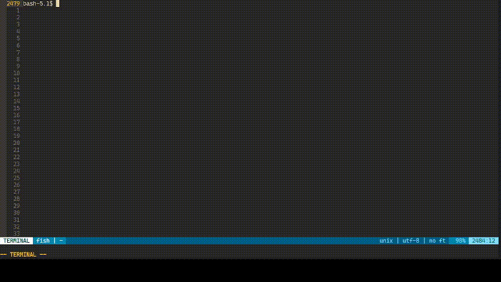

# Ups
Check for programs updates (useful for maintaining packages)

# Guide with example 
Taking an aur pacakge I maintain as an example: https://aur.archlinux.org/packages/python-loguru/

1. Create a script that checks for last release https://github.com/sigmaSd/Ups/blob/master/script_examples/python-loguru.sh
2. Register this program and its script: `ups insert python-loguru script_examples/python-loguru.sh`
3. Check for the latest version by running: `ups` This shows us that the latest version is v.v.v and the snapshot version is not set
4. Update the aur package then once I'm done I can snapshot the last version: `ups snapshot python-loguru`
5. Now I can regulary run `ups` to see if the latest version changes. 

